# eDoctor

HealthTech web app built with ASP.NET Core 10 MVC.

## Preview

### Home


### Doctors

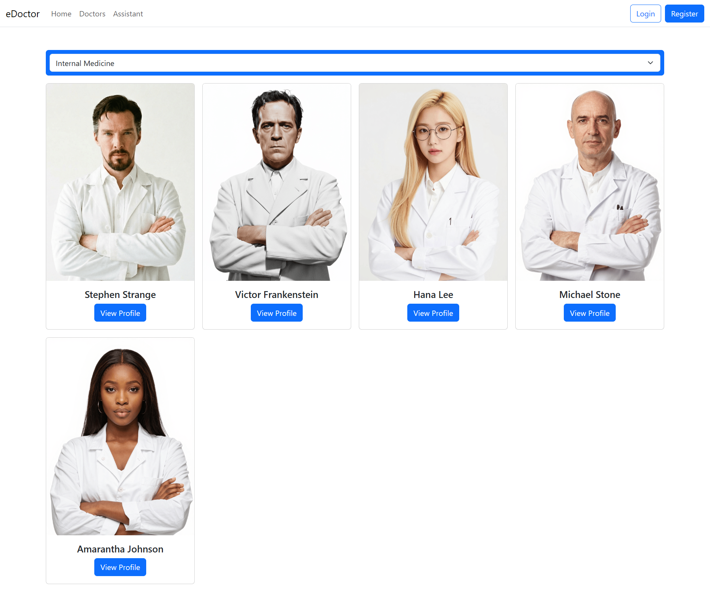

### Detail Doctor

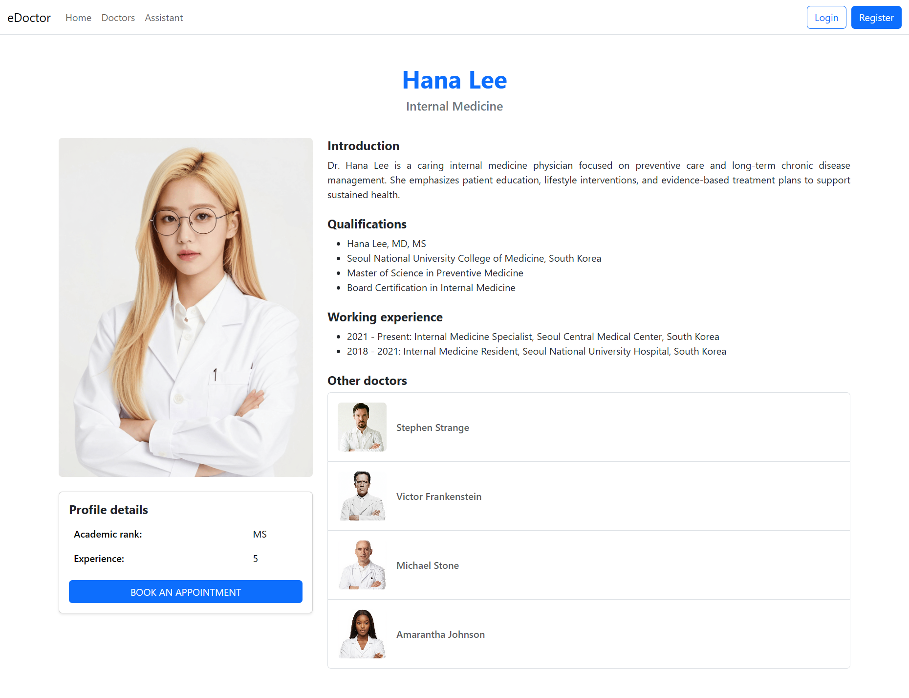

### User Schedules

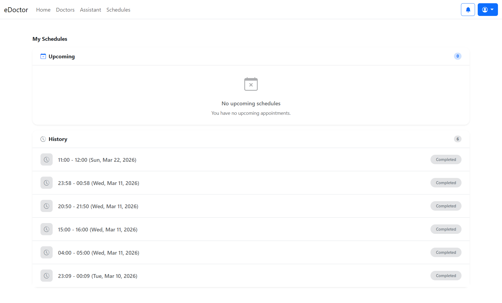

### User Detail Schedule

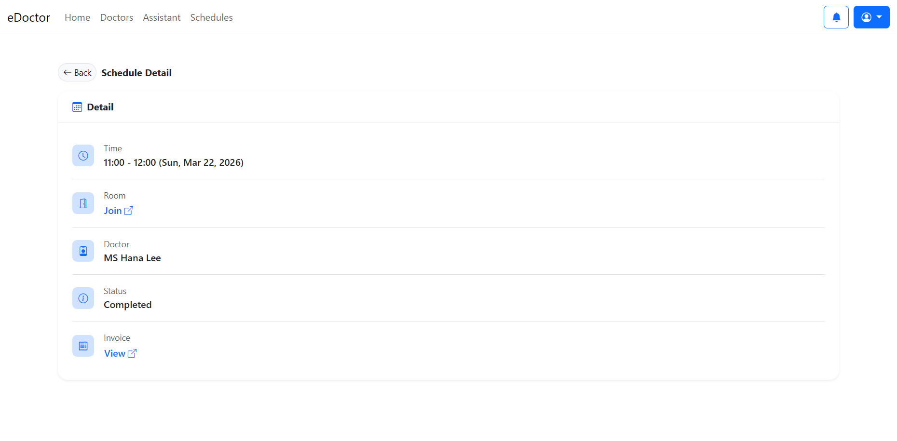

### Medical Record

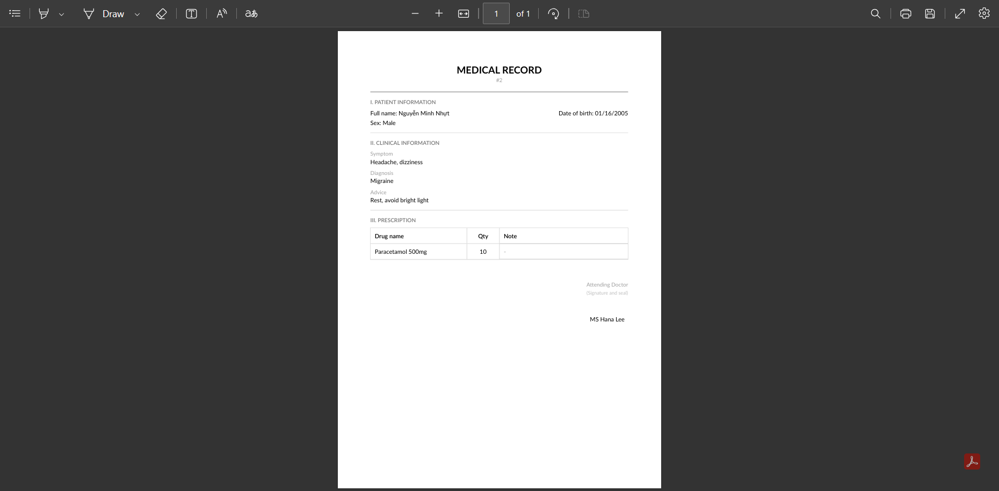

### Payment

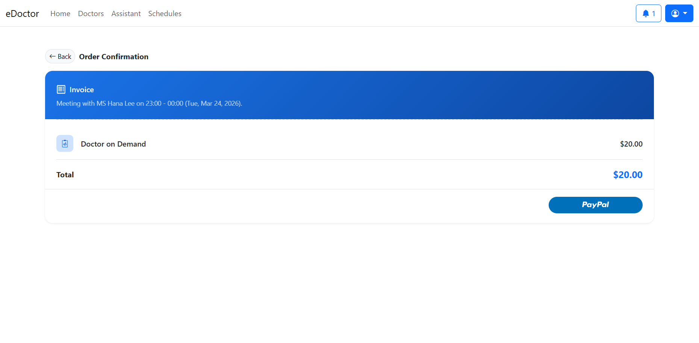

### Invoice

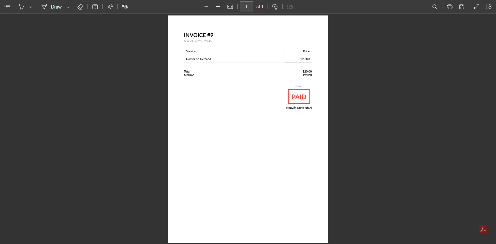

### Meeting

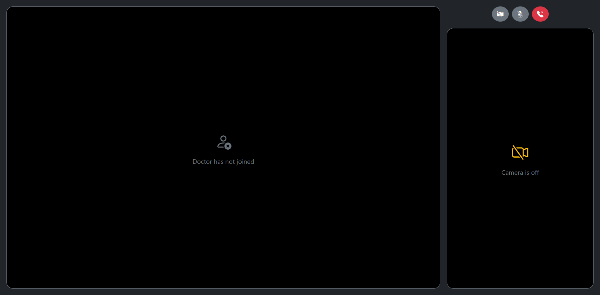

### Assistant

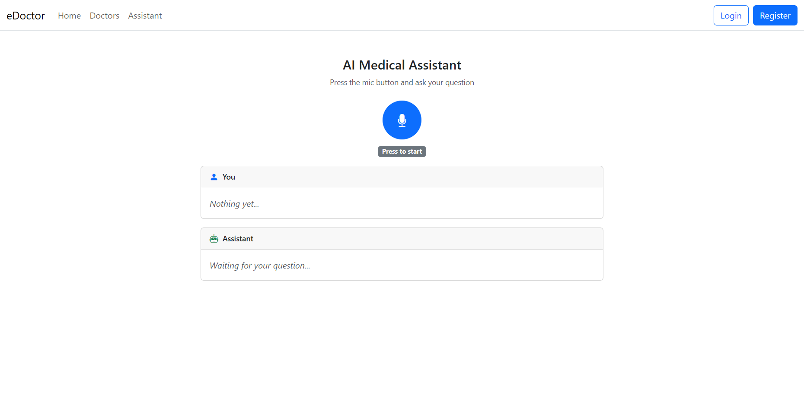

## Prerequisites

- .NET 10 SDK
- Visual Studio
- SSMS
- PayPal Account
- Metered Account
- [Another repository](https://github.com/talachanvuong/edoctor-ai)

## Setup

Fill out `secrets.json` using this template:

```json
{
  "ConnectionStrings": {
    "DefaultConnection": ""
  },
  "PayPal": {
    "OAuthClientId": "",
    "OAuthClientSecret": ""
  },
  "Metered": {
    "Username": "",
    "Password": ""
  },
  "WebSocketServer": ""
}
```

Right-click `libman.json` in Visual Studio and select "Restore Client-Side Libraries"

Open Package Manager Console and type:

```powershell
Update-Database
```

Open SSMS and run `assets/data/initial-data.sql` to load the initial data

## Note

Access `/Doctor` for the doctor site

## Testing Data

### PayPal Account

Email: `alexnguyen@test.com`  
Password: `Default@123`

### Doctor Account

Login name: `stephenstrange`, `victorfrankenstein`, `hanalee`, `michaelstone`, `amaranthajohnson`, `elenarossi`, `junpark`, `hiroshitanaka`, `yurihan`, `kangminseo`  
Password: `Default@123`

## Overall System Architecture

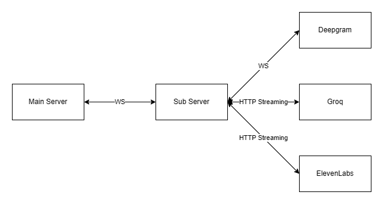

## Layered Architecture

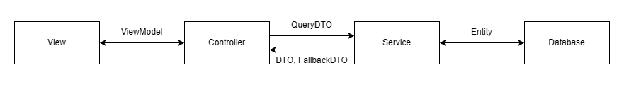
